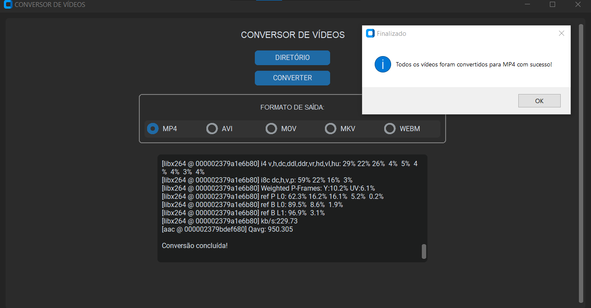
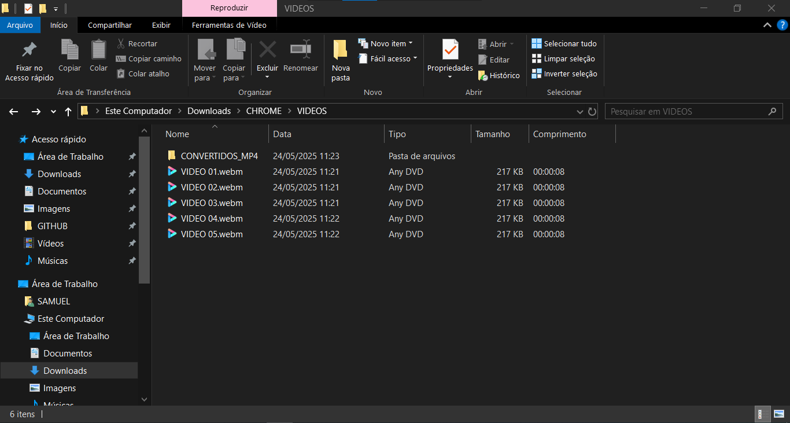
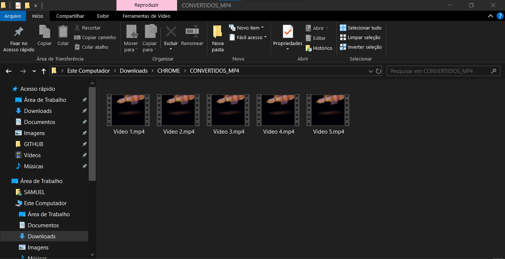

# VIDEO CONVERTER
📱ESTE APLICATIVO CONVERTE AUTOMATICAMENTE ARQUIVOS DE VÍDEO PARA UM FORMATO ESCOLHIDO PELO USUÁRIO (COMO: "MP4", "AVI", "MOV", "MKV", "WEBM") USANDO O FFMPEG.

 <br>
 <br>
 <br>

## DESCRIÇÃO:
O aplicativo é um **Conversor de Vídeos com interface gráfica moderna**, desenvolvido com `customtkinter`, `tkinter`, `ffmpeg` e `threading`. Ele permite converter automaticamente arquivos de vídeo de um diretório para um novo formato com poucos cliques, mantendo uma interface intuitiva e responsiva.

Ideal para quem precisa converter vários vídeos de forma rápida e centralizada, com feedback visual de progresso e status em tempo real.

## FUNCIONALIDADES:
✅ **Conversão automática** de todos os arquivos de vídeo em um diretório para o formato desejado.

🎞️ **Suporte a formatos populares**: `MP4`, `AVI`, `MOV`, `MKV`, `WEBM`, entre outros.

🖼️ **Interface gráfica moderna (tema escuro)** com `customtkinter`, responsiva e redimensionável.

📁 **Botão de seleção de diretório** para escolher a pasta com os vídeos que serão convertidos.

🔘 **Botões horizontais de seleção de formato** (MP4, AVI, MOV, MKV, WEBM), centralizados e organizados em uma área com borda visual elegante.

⚙️ **Conversão em segundo plano (thread)**, sem travar a interface.

📊 **Barra de progresso com contador e percentual**, indicando visualmente o andamento da conversão.

📝 **Área de status com logs em tempo real**, exibindo mensagens do `ffmpeg`, nomes dos arquivos e possíveis erros.

🔄 Ao iniciar uma nova conversão, **a barra de progresso e os logs são reiniciados automaticamente**, mas **a mensagem do diretório selecionado é preservada**.

📂 Os arquivos convertidos são salvos em uma **subpasta automática chamada `CONVERTIDOS_<FORMATO>`** (exemplo: `CONVERTIDOS_MP4`), dentro do mesmo diretório original.

✅ Ao final da conversão, uma mensagem de sucesso é exibida e o caminho da pasta de saída é mostrado no log.

## COMO USAR?
1. **Instale as bibliotecas necessárias:** Antes de executar o app, certifique-se de instalar todas as dependências necessárias. No terminal, execute o seguinte comando para instalar as dependências listadas no arquivo requirements.txt em `CODIGO`:
   ```bash
   pip install -r requirements.txt
   ```

2. **Instalar `ffmpeg`:** O App depende da ferramenta externa chamada `ffmpeg` para converter os arquivos de vídeo.

   1. **Baixar `ffmpeg`:**
      - Vá para o site oficial: [https://ffmpeg.org/download.html](https://ffmpeg.org/download.html).
      - Na seção de downloads, clique em "Windows builds from gyan.dev" ou um equivalente.
      - Baixe o arquivo ZIP de uma versão estável, por exemplo: `ffmpeg-git-full.7z`.

   2. **Extrair o `ffmpeg`:**
      - Extraia o conteúdo do arquivo baixado para uma pasta em seu computador, como `C:\ffmpeg`.

   3. **Adicionar `ffmpeg` ao caminho (PATH):**
      - Abra o **Painel de Controle** e vá para **Sistema e Segurança** > **Sistema** > **Configurações avançadas do sistema**.
      - Clique em **Variáveis de Ambiente**.
      - Em **Variáveis de Sistema**, selecione a variável **Path** e clique em **Editar**.
      - Adicione uma nova entrada com o caminho completo para a pasta `bin` dentro da pasta onde você extraiu o `ffmpeg`, por exemplo: `C:\ffmpeg\bin`.
      - Clique em **OK** e feche as janelas.

   4. **Verificar a instalação:**
      - Abra o Prompt de Comando e digite `ffmpeg` para verificar se está funcionando corretamente. Você deve ver uma lista de comandos suportados se tudo foi configurado corretamente.

3. **Executar o APP:**
   * No diretório `./CODIGO`, execute o aplicativo com o comando:

   ```bash
   python CODIGO.py
   ```

4. **Abrir o Programa:**
   Execute o script Python. A janela principal do conversor será exibida em modo maximizado e com tema escuro.

5. **Selecionar um Diretório**
   Clique no botão **"DIRETÓRIO"** para escolher a pasta onde estão os seus vídeos.
   O caminho selecionado será exibido na caixa de status.

6. **Escolher o Formato de Saída:**
   Selecione o formato desejado clicando em um dos botões horizontais (por exemplo: `MP4`, `AVI`, `MKV`, etc).

7. **Iniciar a Conversão:**
   Clique no botão **"CONVERTER"** para iniciar o processo.
   Isso irá:

   * Zerar a barra de progresso.
   * Limpar os logs anteriores da área de status (preservando o diretório selecionado).
   * Iniciar a conversão em segundo plano, mantendo a interface responsiva.

8. **Acompanhar o Progresso:**
   * A barra de progresso será atualizada a cada vídeo convertido.
   * A contagem e o percentual aparecerão abaixo da caixa de status.
   * A área de status exibirá mensagens em tempo real do `ffmpeg`, além de possíveis erros.

9. **Conferir os Arquivos Convertidos:**
   * Após a finalização, será exibida uma mensagem de sucesso.
   * A caixa de status mostrará **"Conversão concluída!"** e também o caminho da pasta onde os arquivos foram salvos.
   * Os vídeos convertidos estarão em uma subpasta criada automaticamente chamada:
     **`CONVERTIDOS_<FORMATO>`** (por exemplo: `CONVERTIDOS_MP4`), dentro da pasta original.

## SOBRE O EXECUTAVEL E O INSTALADOR:
### 1. EXECUTANDO O INSTALADOR:
   * O instalador está localizado no diretório `./APP` e está disponível apenas para sistemas **Windows x64**. Para realizar a instalação, basta **dar dois cliques no arquivo** e seguir as instruções exibidas na tela.
   * **Observação:** Certifique-se de que o `ffmpeg` esteja instalado e adicionado à variável de ambiente PATH do sistema para que o aplicativo funcione corretamente.

### 2. GERANDO O EXECUTAVEL:
> **IMPORTANTE:** Antes de criar o instalador, é necessário gerar o arquivo `VIDEO CONVERTER.exe`. Para isso, siga os passos abaixo:

   **1. Instalação do PyInstaller:**
   * Certifique-se de ter o PyInstaller instalado. Se não tiver, instale usando o comando abaixo:
   ```bash
   pip install pyinstaller
   ```

   **2. Gerando o Executável:**
   * No diretório `./CODIGO`, utilize o comando abaixo para gerar o executável:

   ```bash
   pyinstaller EXECUTAVEL.spec
   ```

   * O executável `VIDEO CONVERTER.exe` será criado na pasta `./CODIGO/dist`.
   * Após a geração, você pode excluir a pasta `./CODIGO/build`.

### 3. GERANDO O INSTALADOR:
#### PASSO 1: BAIXAR E INSTALAR O INNO SETUP:
1. **Download**: Baixe o Inno Setup do site oficial: [Inno Setup](http://www.jrsoftware.org/isdl.php).
2. **Instalação**: Siga o assistente de instalação para instalar o Inno Setup no seu sistema.

#### PASSO 2: CRIAR O INSTALADOR:
> **IMPORTANTE:** Antes de criar o novo instalador, certifique-se de excluir o arquivo `./APP/VIDEO CONVERTER.exe`.

1. **Editar o arquivo do instalador:**
   * No diretório `./CODIGO`, abra o arquivo `INSTALADOR.iss` e atualize o seguinte trecho:

   * Localize a diretiva `#define Diretorio` e substitua pelo caminho correto do diretório do projeto. Exemplo:

     ```ini
     #define Diretorio "C:\Users\HP\Downloads\GITHUB\REPOSITORIO\02-PROJETOS PUBLICOS\02-APLICATIVOS\VIDEO CONVERTER\CODIGO"
     ```

2. **Gerar o instalador no Inno Setup:**
   * Abra o arquivo `./CODIGO/INSTALADOR.iss` com o **Inno Setup**.
   * Clique em **"Compile"** para gerar o instalador.

3. **Limpar arquivos temporários:**
   * Após a criação do instalador, você pode excluir o executável temporário `./CODIGO/dist/VIDEO CONVERTER.exe`.

4. **Instalando o Aplicativo:**
   * Se o `Aplicativo` não iniciar automaticamente a instalação, você pode executar manualmente o arquivo `./APP/VIDEO CONVERTER.exe` clicando duas vezes sobre ele.
   * O assistente de instalação será iniciado e, por padrão, o aplicativo será instalado no seguinte caminho: `C:\Program Files\VIDEO CONVERTER`.

## NÃO SABE?
- Entendemos que para manipular arquivos em muitas linguagens e tecnologias, é necessário possuir conhecimento nessas áreas. Para auxiliar nesse aprendizado, oferecemos cursos gratuitos e alguns subsídios:
* [CURSO DE PYTHON](https://github.com/VILHALVA/CURSO-DE-PYTHON)
* [CURSO DE CUSTOMTKINTER](https://github.com/VILHALVA/CURSO-DE-CUSTOMTKINTER)
* [CONFIRA MAIS CURSOS](https://github.com/VILHALVA?tab=repositories&q=+topic:CURSO)
* [DOCUMENTAÇÃO OFICIAL DO PYINSTALLER](https://pyinstaller.org/en/stable/)
* [DOCUMENTAÇÃO OFICIAL DO INNO SETUP](http://www.jrsoftware.org/isinfo.php)

## CREDITOS E MAIS:
- [PROJETO BASEADO NO "AUDIO CONVERTER"](https://github.com/VILHALVA/AUDIO-CONVERTER)
- [CLIQUE AQUI PARA VER O HISTÓRICO DE ATUALIZAÇÕES](./UPDATES.md)